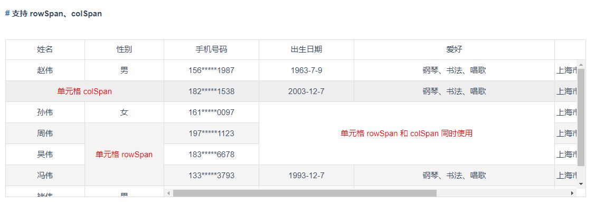
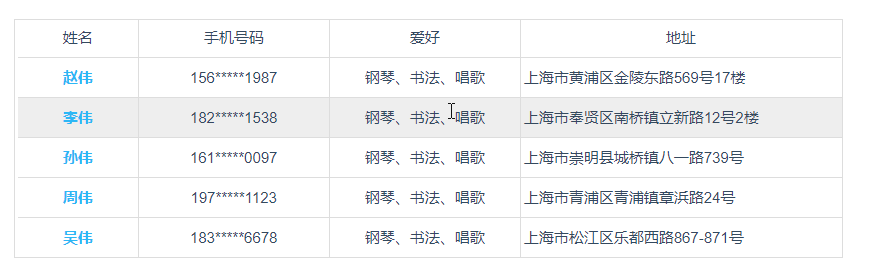
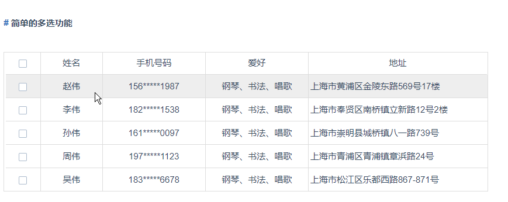

[](https://www.npmjs.com/package/vue-easytable)
[](http://www.opensource.org/licenses/mit-license.php)

# vue-easytable

[切换中文](https://github.com/huangshuwei/vue-easytable/blob/master/README-CN.md)


## Introduction
Based on vue2.x flexible table components.

## API & Examples(如果访问不了说明被墙了，我也很无奈......)
[API&Examples](http://doc.huangsw.com/vue-easytable/app.html#/install)

## Features
- [x] [Adaptive, you can automatically adapt to the browser window changes](http://doc.huangsw.com/vue-easytable/app.html#/table?anchor=table-simple-table-resize)
- [x] [Fixed column, header fixed](http://doc.huangsw.com/vue-easytable/app.html#/table?anchor=table-frozen-title-columns)  
- [x] [Support column width drag](http://doc.huangsw.com/vue-easytable/app.html#/table?anchor=table-column-width-drag)
- [x] [Supports single field sorting and multiple field sorting](http://doc.huangsw.com/vue-easytable/app.html#/table?anchor=table-sort-by-single-columns)
- [x] [Custom columns, custom cell styles](http://doc.huangsw.com/vue-easytable/app.html#/table?anchor=table-custom-columns)
- [x] [Loading effects, custom loading, etc](http://doc.huangsw.com/vue-easytable/app.html#/table?anchor=table-loading-and-error-content)
- [x] [Own paging component](http://doc.huangsw.com/vue-easytable/app.html#/pagination)
- [x] [Cell Editing](http://doc.huangsw.com/vue-easytable/app.html#/table?anchor=table-cell-edit-advanced)
- [x] [Support cell merge (colSpan and rowSpan)](http://doc.huangsw.com/vue-easytable/app.html#/table?anchor=table-cell-merge)
- [x] [Support checkbox selection](http://doc.huangsw.com/vue-easytable/app.html#/table?anchor=table-selection-advanced)  
- [x] [Footer summary](http://doc.huangsw.com/vue-easytable/app.html#/table?anchor=table-footer-summary)
- [ ] Export excel
- [ ] Export PDF
- [ ] Conditional filter
- [ ] Row expansion
- [ ] Vertical column drag
   

## Install

```javascript
npm install vue-easytable --save-dev
```

## Usage（[more usage](http://doc.huangsw.com/vue-easytable/app.html)）


```javascript
// import css
import 'vue-easytable/libs/themes-base/index.css'

// import table and pagination comp
import {VTable,VPagination} from 'vue-easytable'

// Register to global
Vue.component(VTable.name, VTable)
Vue.component(VPagination.name, VPagination)
```

> also you can use it **[by cdn](http://doc.huangsw.com/vue-easytable/app.html#/install)**


## Effect
**Adaptive、Fixed column, header fixed、Support column width drag、Custom columns, custom cell styles、Own paging component**


**Support cell merge**


**Cell Editing**


**Support checkbox selection**


## License
http://www.opensource.org/licenses/mit-license.php


