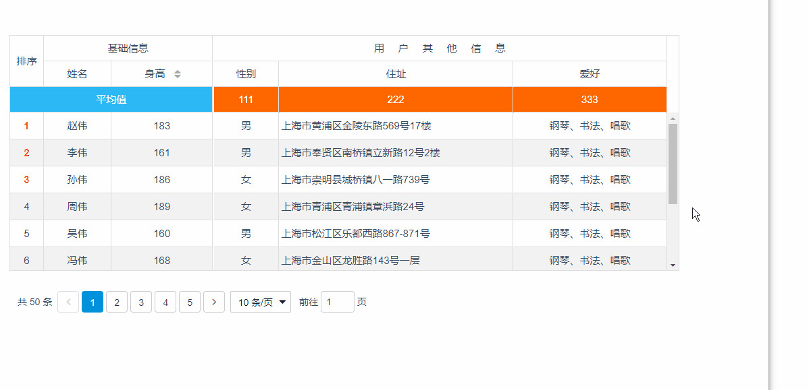

### 介绍
基于 vue2.x 的 table 组件


### 主要功能
1. 自适应，可以随着浏览器窗口改变自动适应
2. 固定列，表头固定
3. 列宽拖动（默认支持）
4. 排序，支持单个、多个字段排序
5. 自定义列、自定义单元格样式、loading效果等
6. 自带分页组件

### 安装

```javascript
npm install vue-easytable --save-dev
```

### 使用


```javascript
import 'vue-easytable/libs/themes-base/index.css'
import {VTable,VPagination} from 'vue-easytable'

Vue.component(VTable.name, VTable)
Vue.component(VPagination.name, VPagination)
```

### 效果展示



